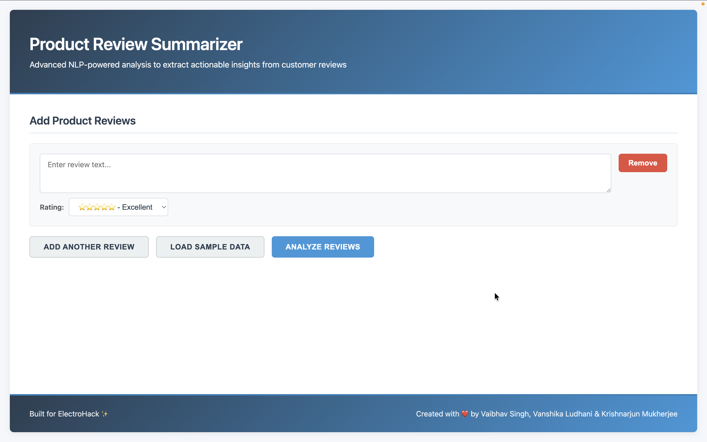
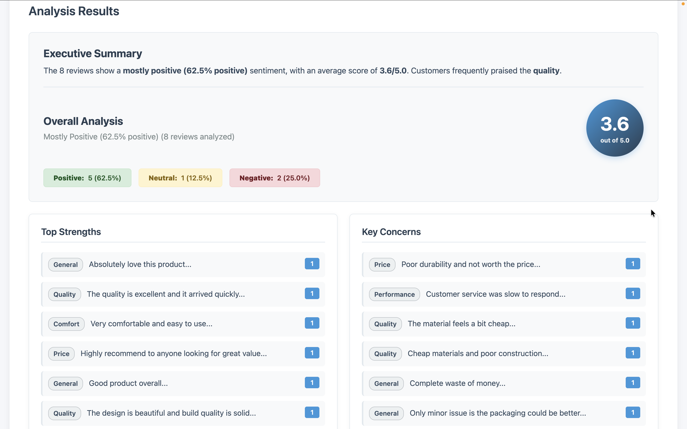

# 🌟 Product Review Summarizer

> **Advanced NLP-powered analysis to extract actionable insights from customer reviews**

Built for **ElectroHack** ✨ | Created with ❤️ by **Vaibhav Singh**, **Vanshika Ludhani** & **Krishnarjun Mukherjee**

---

## 📋 Table of Contents

- [Overview](#-overview)
- [Problem Statement](#-problem-statement)
- [Features](#-features)
- [Tech Stack](#-tech-stack)
- [Project Structure](#-project-structure)
- [Installation](#-installation)
- [Usage](#-usage)
- [How It Works](#-how-it-works)
- [API Documentation](#-api-documentation)
- [Screenshots](#-screenshots)
- [Contributing](#-contributing)
- [License](#-license)

---

## 🎯 Overview

The **Product Review Summarizer** is an intelligent NLP-based web application that automatically analyzes large sets of customer reviews and generates concise, actionable summaries. Instead of manually reading through hundreds of reviews, users can instantly understand the overall sentiment, common pros and cons, and key product aspects.

This tool helps:

- **E-commerce Buyers**: Make informed purchasing decisions quickly
- **Product Managers**: Understand customer feedback at scale
- **Business Analysts**: Extract insights from customer sentiment data
- **Marketing Teams**: Identify product strengths and weaknesses

---

## 🎪 Problem Statement

**Challenge**: Buyers struggle to go through hundreds of product reviews before making a purchase decision. Reading all reviews is time-consuming, and it's difficult to identify common patterns in customer feedback.

**Solution**: Build an NLP model that automatically summarizes large sets of reviews into:

- Concise pros and cons
- Common keywords and sentiment trends
- Overall summary score
- Aspect-level analysis (quality, price, performance, etc.)

---

## ✨ Features

### Core Functionality

- **Executive Summary**: AI-generated high-level overview of all reviews
- **Overall Score**: Calculated weighted rating out of 5.0 stars
- **Sentiment Analysis**: Classifies reviews as Positive, Neutral, or Negative
- **Pros & Cons Extraction**: Automatically identifies common strengths and concerns
- **Keyword Extraction**: Highlights frequently mentioned terms
- **Aspect-Based Analysis**: Breaks down sentiment by product aspects:
  - Quality
  - Price/Value
  - Performance
  - Comfort
  - Design
  - Delivery
  - Customer Service
  - Durability

### User Interface

- **Clean, Modern Design**: Professional gradient header and card-based layout
- **Interactive Review Input**: Add, remove, and edit multiple reviews
- **Sample Data Loading**: Pre-loaded sample reviews for quick testing
- **Real-time Analysis**: Instant feedback with loading indicators
- **Responsive Visualization**: Sentiment badges, progress bars, and keyword clouds
- **Smooth Animations**: Fade-in effects and smooth scrolling

### Technical Features

- **Custom NLP Engine**: Built from scratch without external NLP libraries
- **RESTful API**: Flask backend with CORS support
- **Modular Architecture**: Separation of concerns with clean code structure
- **Error Handling**: Comprehensive error handling and user feedback
- **JSON Export**: Results can be exported for further analysis

---

## 🛠️ Tech Stack

### Frontend

- **HTML5**: Semantic markup structure
- **CSS3**: Modern styling with gradients, animations, and responsive design
- **JavaScript (ES6+)**: Async/await for API calls, DOM manipulation

### Backend

- **Python 3.x**: Core programming language
- **Flask**: Lightweight web framework
- **Flask-CORS**: Cross-Origin Resource Sharing support
- **NumPy**: Numerical computations for sentiment analysis

### NLP Components

- Custom-built NLP engine with:
  - Text preprocessing and tokenization
  - Sentiment scoring algorithm
  - Keyword extraction (TF-IDF-like approach)
  - Aspect identification
  - Pattern recognition for pros/cons

---

## 📁 Project Structure

```
product-review-summarizer/
│
├── app.py                      # Flask API server
├── review_summarizer.py        # Core NLP engine
├── index.html                  # Frontend interface
├── styles.css                  # UI styling
├── script.js                   # Frontend logic
├── requirements.txt            # Python dependencies
├── review_summary.json         # Sample output (generated)
└── README.md                   # Project documentation
```

### File Descriptions

**Backend Files:**

- `app.py`: Flask application with `/summarize` endpoint for processing reviews
- `review_summarizer.py`: Complete NLP implementation including:
  - `ReviewSummarizer` class: Main analysis engine
  - `ReviewSummary` dataclass: Structured output format
  - Sentiment analysis algorithms
  - Keyword and aspect extraction logic

**Frontend Files:**

- `index.html`: Main application interface with review input forms
- `styles.css`: Comprehensive styling with modern design patterns
- `script.js`: Client-side logic for API communication and result rendering

**Configuration:**

- `requirements.txt`: Python package dependencies
- `review_summary.json`: Example output for reference

---

## 🚀 Installation

### Prerequisites

- Python 3.7 or higher
- pip (Python package manager)
- Modern web browser (Chrome, Firefox, Safari, Edge)

### Step 1: Clone the Repository

```bash
git clone https://github.com/yourusername/product-review-summarizer.git
cd product-review-summarizer
```

### Step 2: Create Virtual Environment (Recommended)

```bash
# On Windows
python -m venv venv
venv\Scripts\activate

# On macOS/Linux
python3 -m venv venv
source venv/bin/activate
```

### Step 3: Install Dependencies

```bash
pip install -r requirements.txt
```

### Step 4: Verify Installation

```bash
python review_summarizer.py
```

This should run the demo analysis and create a `review_summary.json` file.

---

## Usage

### Starting the Application

#### 1. Start the Flask Backend

Open a terminal and run:

```bash
python app.py
```

You should see:

```
✅ ReviewSummarizer loaded successfully.
Starting Flask server at http://127.0.0.1:5000
 * Running on http://127.0.0.1:5000
```

#### 2. Open the Frontend

Open `index.html` in your web browser:

- **Option A**: Double-click the file
- **Option B**: Right-click → Open with → [Your Browser]
- **Option C**: Use a local server (e.g., Live Server in VS Code)

### Using the Application

#### Option 1: Load Sample Data

1. Click the **"Load Sample Data"** button
2. Review the pre-loaded sample reviews
3. Click **"Analyze Reviews"** to see results

#### Option 2: Add Custom Reviews

1. Enter review text in the textarea
2. Select a star rating (1-5 stars)
3. Click **"Add Another Review"** to add more
4. Click **"Analyze Reviews"** to process

#### Understanding Results

The analysis provides:

- **Executive Summary**: Quick overview of findings
- **Overall Score**: Weighted average rating
- **Sentiment Distribution**: Breakdown of positive/neutral/negative reviews
- **Top Strengths**: Most mentioned positive aspects
- **Key Concerns**: Most mentioned negative aspects
- **Aspect-Level Analysis**: Sentiment for each product aspect
- **Keyword Cloud**: Frequently mentioned terms

---

## 🔍 How It Works

### NLP Pipeline

#### 1. Text Preprocessing

```python
def preprocess_text(self, text: str) -> List[str]:
    # Convert to lowercase
    # Remove special characters
    # Tokenize into words
    # Remove stopwords
    # Filter short words
```

#### 2. Sentiment Scoring

```python
def calculate_sentiment_score(self, text: str) -> float:
    # Count positive words
    # Count negative words
    # Calculate sentiment score: (positive - negative) / total
    # Returns value between -1 (negative) and 1 (positive)
```

#### 3. Pros and Cons Extraction

- Extracts sentences from reviews
- Classifies sentiment of each sentence
- Groups similar sentiments by aspect
- Ranks by frequency and sentiment strength

#### 4. Keyword Extraction

- Tokenizes all review text
- Calculates term frequency across corpus
- Filters stopwords and common terms
- Returns top keywords by relevance

#### 5. Aspect Analysis

- Identifies product aspects using keyword matching
- Calculates average sentiment per aspect
- Tracks mention frequency
- Generates aspect-level insights

### Algorithm Details

**Sentiment Classification:**

- Score > 0.2 → Positive
- Score < -0.2 → Negative
- -0.2 ≤ Score ≤ 0.2 → Neutral

**Overall Score Calculation:**

```python
overall_score = (weighted_sum_of_ratings + sentiment_adjustment) / total_reviews
```

**Keyword Ranking:**
Uses a simplified TF-IDF approach:

1. Calculate term frequency in reviews
2. Weight by review sentiment
3. Filter by relevance threshold
4. Sort by weighted frequency

---

## 📊 Screenshots

### Main Interface

<p align="center">
  
</p>

### Executive Summary

<p align="center">
  
</p>

### Analysis Results

<p align="center">
  
</p>

---

## 👥 Authors

**Vaibhav Singh**

- Role: Backend Development & NLP Implementation
- Contributions: Core algorithm design, Flask API

**Vanshika Ludhani**

- Role: Frontend Development & UI/UX Design
- Contributions: Interface design, responsive styling

**Krishnarjun Mukherjee**

- Role: Full Stack Integration & Testing
- Contributions: API integration, testing, documentation

---

## 🙏 Acknowledgments

- **EES** for organizing the hackathon **ElectroHack**

---

**Built with 💙 for making online shopping easier, one review at a time.**
